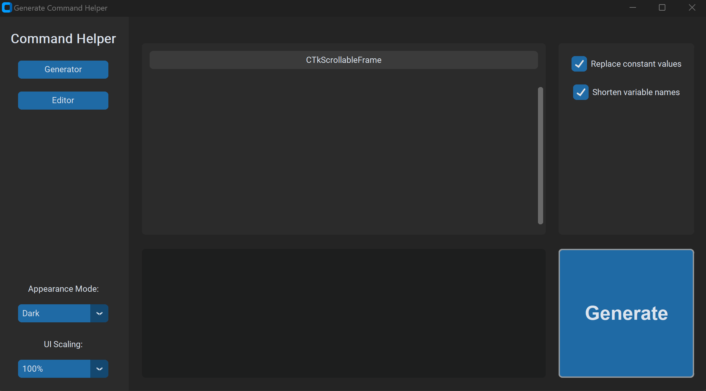
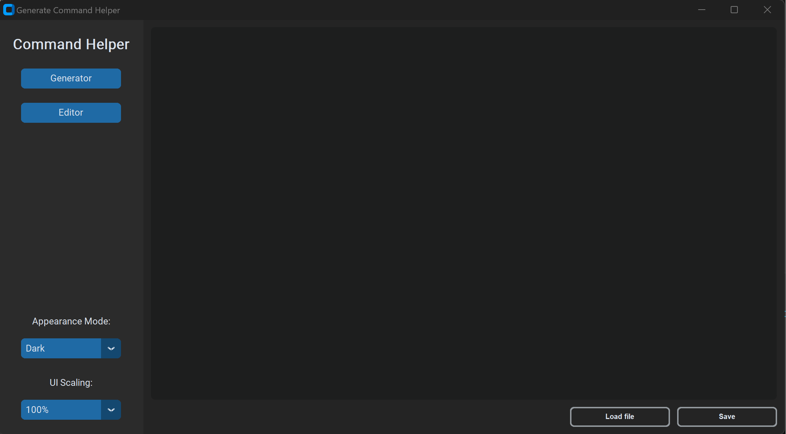
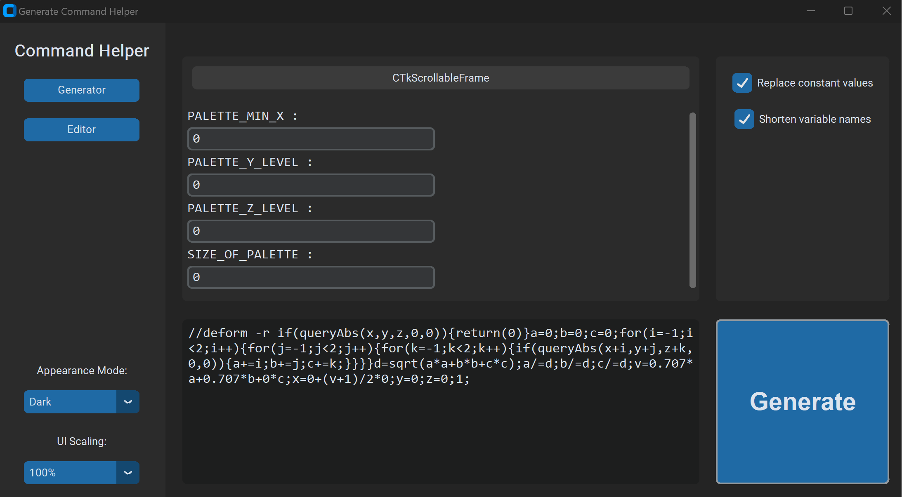

# Generate-Command-Helper

### Description
This is a tool for creating FAWE generate and deform commands. The tool provides a user-friendly UI for writing, editing, and saving commands. 

### Table of Contents  
[Usage](#usage)  
[Syntax](#syntax)  
[References](#references)

### Usage

Before running the code, make sure you have the following dependencies installed:
* tkinter
* customtkinter

These can be installed with `pip install tkinter` and `pip install customtkinter`

Running the `main.py` file should open a GUI that looks like this

To start writing your command, click the `Editor` Button in the left panel

You can write the code directly in the text box, or load the code from an existing text file using the `load` button

Loading the example file `examples/lighting.txt`, we can go back to the Generate page. Clicking the `Generate` button in the bottom right should generate the command. 

Changing the values of the text entries in the middle will change the values of the constants in the command. 

There are two checkboxes in the top right, `Replace constant values` will replace each occurrence of the variable with the provided value. `Shorten variable names` will make all variable names 1 character long

### Syntax

- Command header

Each file must begin with the command name, in `examples/lighting.txt` this command is `//deform -r`
- Constants

Constant variables must be declared in `ALL_UPPERCASE`, but can use `_`, `-`, and digits 0-9

- Spaces

All spaces and tabs are ignored, as an effect of this `return()` must be used with brackets

### References

- TomSchimansky CustomTkinter template https://github.com/TomSchimansky/CustomTkinter/blob/master/examples/complex_example.py
- Further reading on expressions and generate commands https://docs.google.com/document/d/1-o4dyb0ahlnn4tDgWfoTvUEQ2yBKDx_9qnUFWMJXgY0/edit#heading=h.qzyu255loovj